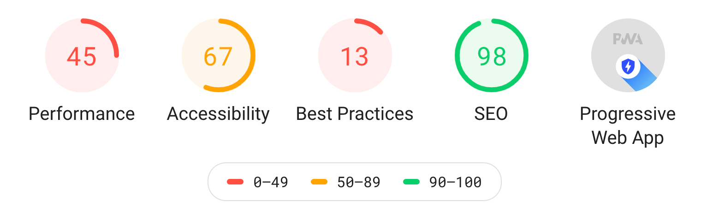

project_path: /web/tools/_project.yaml
book_path: /web/tools/_book.yaml
description: How scoring works in Lighthouse

{# wf_updated_on: 2019-07-22 #}
{# wf_published_on: 2018-05-04 #}
{# wf_blink_components: N/A #}

[details]: https://docs.google.com/spreadsheets/d/1up5rxd4EMCoMaxH8cppcK1x76n6HLx0e7jxb0e0FXvc/edit#gid=0
[calculator]: https://docs.google.com/spreadsheets/d/1up5rxd4EMCoMaxH8cppcK1x76n6HLx0e7jxb0e0FXvc/edit#gid=283330180
[WikiHow]: https://www.wikihow.com/Calculate-Weighted-Average#Weighted_Averages_without_Percentages_sub

# Lighthouse Scoring Guide {: .page-title }

The scores that you see at the top of your Lighthouse report represent the page's score for
that particular category. This guide explains how Lighthouse calculates those scores.

<figure>
  
</figure>

## The Performance score {: #perf }

Lighthouse returns a Performance score between 0 and 100. A score of `null` may be returned if there are errors within the category. 0 is the lowest possible score. 100 is the best possible ideal score (really hard to get). Any green score (90+) is considered good. Usually, any score above a 90 gets you in the top ~5% of performant webpages.

[bug]: https://github.com/GoogleChrome/lighthouse/issues/new

### Which Performance audits contribute to your score {: #perf-audits }

The performance score is determined from **the performance metrics only**. The Opportunities/Diagnostics sections do not directly contribute to the performance score. That said, improving the opportunties and diagnostics likely improve the metric values, so there is an indirect relationship.

Currently in Lighthouse v5, the weighting for the Performance Score is:

* 20% - First Contentful Paint
* 6.7% - First Meaningful Paint
* 13.3% - First CPU Idle
* 33.3% - Time To Interactive
* 26.7% - Speed Index
* 0% - Max Potential First Input Delay

The overall Performance score is a [weighted average][WikiHow]{:.external} of these metrics.

See [Scoring Calculator][calculator]{:.external} to experiment with how getting different scores
in each audit affects your overall Performance score.

[FMP]: /web/tools/lighthouse/audits/first-meaningful-paint
[FI]: /web/tools/lighthouse/audits/first-interactive
[CI]: /web/tools/lighthouse/audits/consistently-interactive
[PSI]: /web/tools/lighthouse/audits/perceptual-speed-index
[EIL]: /web/tools/lighthouse/audits/estimated-input-latency

### How each Performance metric is scored {: #perf-scoring }

Lighthouse maps each metric value to a number between 0 and 100. The scoring distribution is
a log normal distribution derived from the performance metrics of real website performance
data on HTTPArchive.

For example, First Meaningful Paint (FMP) measures when a user perceives that the
primary content of a page is visible. The metric value for FMP represents the time duration between
the user initiating the page load and the page rendering its primary content. Based on real
website data, top-performing sites render FMP in about 1,220ms, so that metric value is mapped to
a score of 99.

### How the Performance score is color-coded {: #perf-color-coding }

The color-coding maps to these Performance score ranges:

* 0 to 49 (slow): Red
* 50 to 89 (average): Orange
* 90 to 100 (fast): Green

### How to reduce fluctuations in your Performance score {: #perf-consistency }

When running Lighthouse on real sites, some variability in the Performance score is to be
expected. On each visit, a site may load different ads or scripts, and network conditions may
vary.

Anti-virus scanners, extensions, and other programs that interfere with page load can cause
large variations. Run Lighthouse without these programs to get more consistent results. Consider
running Lighthouse from a continuous integration system, or from a hosted service such as
[WebPageTest](https://webpagetest.org/easy){:.external}.

## The Progressive Web App score {: #pwa }

Scoring of the Progressive Web App (PWA) Category is handled a little differently. While there is a numeric score, the audit groups are most important.

The PWA audits are based on the [Baseline PWA Checklist][checklist],
which lists 14 requirements. Lighthouse has automated audits for 11 of the 14 requirements. The
remaining 3 can only be tested manually. Each of the 11 automated PWA audits are weighted
equally, so each one contributes approximately 9 points to your PWA score.

[checklist]: /web/progressive-web-apps/checklist#baseline

## The Accessibility score {: #a11y }

The Accessibility score is a weighted average of all the accessibility audits. See [Scoring
Details][details]{:.external} for a full list of how each audit is weighted. The heavier-weighted
audits have a bigger impact on your score.

Each accessibility audit is pass or fail. Unlike the Performance audits, a page doesn't get
points for partially passing an accessibility audit. For example, if some elements have
screenreader-friendly names, but others don't, that page gets a 0 for the
screenreader-friendly-names audit.

## The Best Practices score {: #best-practices }

Lighthouse returns a Best Practices score between 0 and 100. 0 is the worst possible score, and
100 is the best.

The Best Practices audits are equally weighted. To calculate how much each audit contributes
to your overall Best Practices score, count the number of Best Practices audits, then divide
100 by that number.

## Feedback {: #feedback .hide-from-toc }


